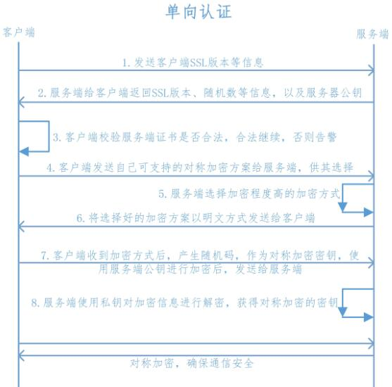

# 关于ssl

### 流程图

### 几点总结

- 客户端，服务端约定通信密钥的过程是使用非对称加密
    1. 真正通信内容是采用对称加密的，交换对称加密密钥的过程是非对称加密的
    2. 客户端产生对称加密的密钥，以服务端的公钥加密，然后发给服务端
    3. 服务端使用自己的私钥解密出真正的通信密钥

- ssl的证书验证
    1. 一端持有CA(证书颁发机构)的根证书，用根证书验证另一端的证书是否合法有效
    2. 网页环境下，浏览器已经自带了所有CA的根证书，所以无需客户端再指定
    3. native环境下，客户端必须指定CA的根证书
